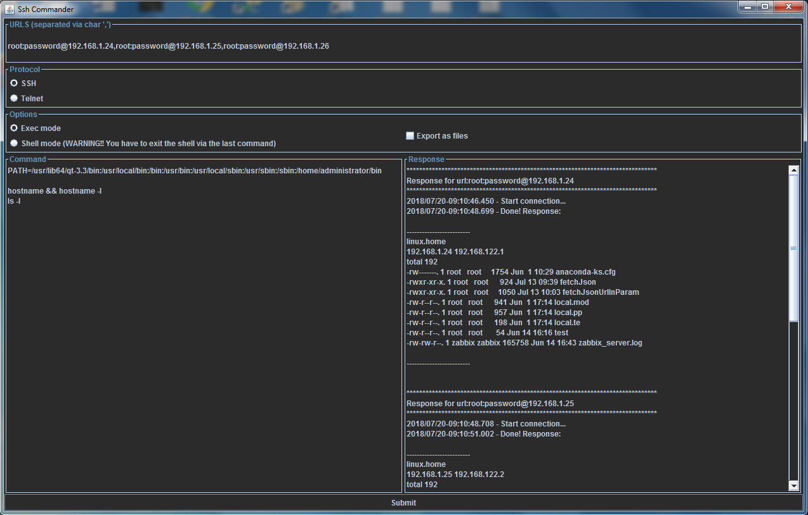

# SshCommander

This is a basic and easy to use JAVA/SWING program used to send mutliple SSH or TELNET commands to one or several hosts.  



## Getting Started

All you need is to download the project and compile with Maven / Java.
It will give you a self executable jar file, that you can use everywhere Java is installed.

### Prerequisites

You'll need at least JAVA 1.6 (or above) and MAVEN 2 (or above)

### Installing

* Download the project folder.
* From the local copy, go in the project folder and execute:
**mvn clean install**
* It will build the file SshCommander-X.X-jar-with-dependencies.jar
* It is an executable jar, that you can run either with the following command:
**java -jar SshCommander-X.X-jar-with-dependencies.jar**
* either by double click on it (on windows for example).


## Built With

* [Maven](https://maven.apache.org/) - Dependency Management


## Authors

* **Quentin MORRIER** - *Creator* - [qmorrier](https://github.com/qmorrier)


## License

This project is licensed under the MIT License - see the [LICENSE.md](LICENSE.md) file for details

## Acknowledgments

Based on [JSCH](http://www.jcraft.com/jsch/)


## Usage

### Configure SSH or TELNET hosts / servers
The hosts are declared as:  
**user**:**password**@**hostIp**

And they are separated by a comma (**,**) char.  
By example:  
```
root:password@10.0.0.1,root:password@10.0.0.2,root:password@10.0.0.2  
```
In case of multiple hosts, like in the above example, the commands are send sequentially host by host (no parallel execution).

### Choose command sending mode
There are two modes for sending commands:

* **Exec mode** : sends all the commands in one string (carriage return contained in the string apply the commands line by line)
* **Shell mode** : sends commands one by one (line by line). The last command must close the connection (like exit for a standart linux Sssh server)

In **Shell mode**, you can also add a pause between commands.  
You've tu use the special syntax as follow:
**==>WAIT( timeInMilliseconds)**  
So by example:
```bash
ls -l
==>WAIT(2000)
ls -l
```
Will execute **ls**, then wait 2 seconds, then execute the second **ls**

### Enter commands
You enter the list of commands on the **Command** area (bottom left).  
The result of the execution is outputted in the **Response** area (bottom right).  
For some SSH server like any standart Linux server, it is necessary to set the PATH environnement variable to find basic commands.  
Here is the PATH that I commonly use:
```
PATH=/usr/lib64/qt-3.3/bin:/usr/local/bin:/bin:/usr/bin:/usr/local/sbin:/usr/sbin:/sbin:/home/administrator/bin
```

### Export result directly into files
The option **Export as files**, creates a directory in the same folder where the executable jar is, with as name the cureent date/time.  
Within this folder, it creates one file per host holding the result of the command.  
There is also a root file, wich hold all the logs (just like the *Response* area).  

### Change font size
You can increase or degrease the font size via:  
**[CTRL]** + **mouse wheel**

### Change colors / theme
You can switch the dark theme to default SWING theme via:  
**[CTRL]** + **[b]**


